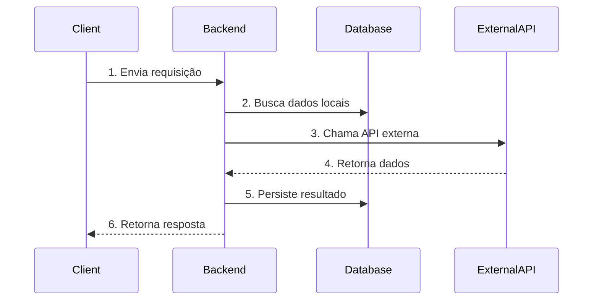

# Software Design Document (SDD) — {slug}

> **Nota:** Este é o documento de design técnico (anteriormente chamado TDD Técnico).
> "TDD" neste projeto refere-se exclusivamente à metodologia Test-Driven Development (Phase 4).

---

## 0. Agent Context (Machine-Readable Summary)

> ⚡ Leitura rápida para agentes. Atualizado ao aprovar cada seção.

| Campo | Valor |
|-------|-------|
| **Status** | draft |
| **Stack** | [Frontend] / [Backend] / [DB] |
| **Entidades principais** | [Entidade1, Entidade2] |
| **Endpoints críticos** | [POST /resource, GET /resource/:id] |
| **Ambientes** | dev / staging / prod |
| **PRD** | docs/PRD-{slug}.md |
| **Aprovado por** | null |

---

## 1. Informações Gerais

| Campo | Valor |
|-------|-------|
| **Título do Projeto** | [Nome da Funcionalidade/Sistema] |
| **Tech Lead** | [Nome] |
| **Product Manager** | [Nome] |
| **Time de Desenvolvimento** | [Nomes] |
| **PRD de Referência** | docs/PRD-{slug}.md |
| **Repositório** | [Link] |

---

## 2. Contexto e Motivação

### 2.1 Contexto
> Descreva o cenário atual e o que será lançado ou alterado.

[Descreva o contexto aqui]

### 2.2 Problema
> Qual dor isso resolve? Por que substituir a solução atual?

[Descreva o problema aqui]

### 2.3 Benefícios Esperados
- [ ] [Benefício 1]
- [ ] [Benefício 2]

---

## 3. Glossário e Conceitos Chave

> Defina termos técnicos, siglas e entidades. Previne alucinações da IA sobre termos ambíguos.

| Termo | Descrição |
|-------|-----------|
| [Entidade/Conceito] | [Explicação do que é e para que serve] |
| [Tecnologia X] | [Descrição e seu papel no sistema] |

---

## 4. Stack e Decisões de Arquitetura

> Decisões arquiteturais maiores devem ser registradas em `docs/adr/ADR-NNN-*.md`.

| Camada | Tecnologia | Justificativa |
|--------|-----------|---------------|
| Frontend | [Next.js / React / etc.] | [Motivo] |
| Backend | [FastAPI / Express / etc.] | [Motivo] |
| Database | [PostgreSQL / MongoDB / etc.] | [Motivo] |
| Auth | [JWT / OAuth / etc.] | [Motivo] |
| Deploy | [Vercel / Railway / etc.] | [Motivo] |

### 4.1 Environment Strategy

| Ambiente | URL | Trigger de Deploy |
|----------|-----|------------------|
| dev | localhost | manual |
| staging | [URL] | push para `staging` |
| prod | [URL] | aprovação manual |

---

## 5. Recursos e APIs Externas

### 5.1 Serviços Externos
| Serviço | Propósito | Documentação |
|---------|-----------|--------------|
| [Nome] | [Para que será usado] | [Link] |

### 5.2 Endpoints Principais (MVP)
| Método | Endpoint | Descrição | MVP? |
|--------|----------|-----------|------|
| `GET` | `/resource/:id` | [O que retorna] | ✅ |
| `POST` | `/resource` | [O que cria] | ✅ |
| `PUT` | `/resource/:id` | [O que atualiza] | ✅ |
| `DELETE` | `/resource/:id` | [O que remove] | 🟡 |

---

## 6. Fluxo Técnico — MVP

### 6.1 Objetivo do MVP
[Definição clara do que entra na primeira versão]

### 6.2 O que NÃO entra no MVP
- [ ] [Feature para depois]
- [ ] [Integração não prioritária]

### 6.3 Fluxo Lógico

### 6.4 Especificações de Entidades

#### [Entidade 1: Nome]

| Campo | Tipo | Obrigatório | Descrição |
|-------|------|-------------|-----------|
| id | UUID | ✅ | Identificador único |
| [campo] | [tipo] | [✅/🟡] | [descrição] |

**Status possíveis:** [ativo, inativo, pendente]

---

## 7. Páginas e Navegação

| Página | Rota | Componentes Principais | Acesso |
|--------|------|------------------------|--------|
| [Home] | `/` | [Header, Hero] | Público |
| [Dashboard] | `/dashboard` | [Sidebar, Cards] | Autenticado |

---

## 8. Escopo e Tarefas

### Status Legend
| Status | Significado |
|--------|-------------|
| `✅ DEFINIDO` | Pronto para implementar |
| `⚠️ INDEFINIDO` | Precisa de mais discovery |
| `❌ FORA DE ESCOPO` | Não implementado nesta fase |

### Fase 1: Setup e Infraestrutura
- [ ] **Configuração de Ambiente** — `✅ DEFINIDO`
  - `.env.example` atualizado, CI configurado

### Fase 2: Entidades Principais
- [ ] **Criação de [Entidade A]** — `✅ DEFINIDO`
  - Verificação: Endpoint POST funcionando

### Fase 3: Regras de Negócio
- [ ] **[Fluxo Principal]** — `✅ DEFINIDO`
  - Verificação: Teste E2E passando

---

## 9. Riscos e Mitigação

| Risco | Probabilidade | Impacto | Mitigação |
|-------|---------------|---------|-----------|
| **Segurança** | Média | Alto | Variáveis de ambiente, rotação de chaves |
| **Dependência Externa** | Baixa | Alto | Plano B, filas de reprocessamento |

---

## 10. Roadmap

| Sprint/Data | Entrega | Dependências |
|-------------|---------|--------------|
| Sprint 1 | Setup Inicial | — |
| Sprint 2 | MVP do Fluxo Principal | Sprint 1 |
| **Go-Live** | [Data Prevista] | Sprint 2 |

---

## 11. Checklist de Validação

### Completude
- [ ] Seção 0 (Agent Context) preenchida
- [ ] Stack e decisões de arquitetura documentados
- [ ] Nenhum item `⚠️ INDEFINIDO` bloqueando MVP
- [ ] Fluxo lógico com diagrama
- [ ] Environment Strategy definida (dev/staging/prod)
- [ ] APIs externas documentadas com endpoints

### Aprovação
- [ ] **Revisado por Tech Lead**
- [ ] **Revisado por Product Manager**
- [ ] **Aprovado para Implementação**

---

## 12. Histórico de Alterações

| Data | Autor | Alteração |
|------|-------|-----------|
| YYYY-MM-DD | [Nome] | Criação inicial |

---

> **⚠️ FONTE DA VERDADE:** Após aprovação, mudanças significativas exigem nova revisão.
> A IA que implementar deve seguir este documento sem questionar as regras de negócio definidas.
