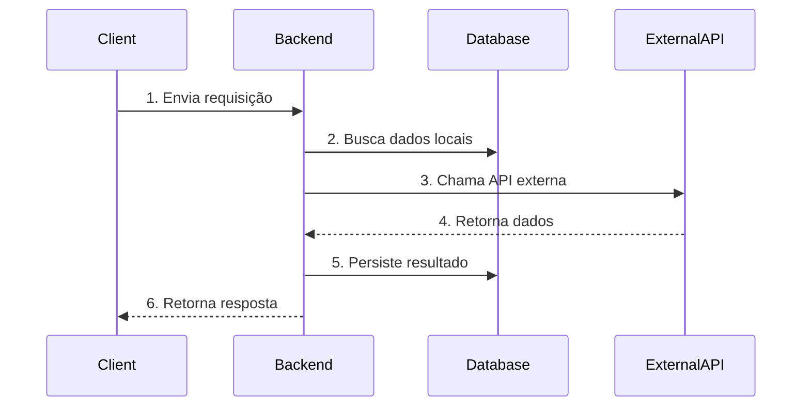

# Technical Design Document (TDD)

> **Status:** [ ] Rascunho | [ ] Em Revisão | [ ] Aprovado  
> **Última Atualização:** YYYY-MM-DD  
> **Fonte da Verdade:** Este documento é a autoridade final após aprovação humana.

---

## 1. Informações Gerais e Metadados

| Campo | Valor |
|-------|-------|
| **Título do Projeto** | [Nome da Funcionalidade/Sistema] |
| **Tech Lead** | [Nome] |
| **Product Manager** | [Nome] |
| **Time de Desenvolvimento** | [Nomes] |
| **Epic/Card (Jira/Linear)** | [Link] |
| **Layouts (Figma)** | [Link] |
| **Repositório** | [Link] |

---

## 2. Contexto e Motivação

### 2.1 Contexto
> Descreva brevemente o cenário atual. O que a empresa/produto vai lançar ou alterar?

[Descreva o contexto aqui]

### 2.2 Problema
> Qual dor isso resolve? Por que substituir a solução atual?

[Descreva o problema aqui]

### 2.3 Benefícios Esperados
- [ ] [Benefício 1 - ex: Escalabilidade]
- [ ] [Benefício 2 - ex: Manutenção reduzida]
- [ ] [Benefício 3 - ex: Suporte a múltiplos países]

---

## 3. Glossário e Conceitos Chave

> Defina termos técnicos, siglas e entidades. Isso evita alucinações da IA sobre termos ambíguos.

| Termo | Descrição |
|-------|-----------|
| [Entidade/Conceito] | [Explicação do que é e para que serve no contexto do sistema] |
| [Tecnologia X] | [Descrição da tecnologia e seu papel] |
| [Conceito de Domínio] | [Ex: O que significa uma "Assinatura" neste domínio] |

---

## 4. Recursos e APIs Externas

> Liste as ferramentas, bibliotecas ou serviços terceiros que serão integrados.

### 4.1 Serviços Externos
| Serviço | Propósito | Documentação |
|---------|-----------|--------------|
| [Nome do Serviço] | [Para que será usado] | [Link] |

### 4.2 Endpoints Principais
| Método | Endpoint | Descrição |
|--------|----------|-----------|
| `GET` | `/resource/:id` | [O que este endpoint retorna] |
| `POST` | `/resource` | [O que este endpoint cria] |
| `PUT` | `/resource/:id` | [O que este endpoint atualiza] |
| `DELETE` | `/resource/:id` | [O que este endpoint remove] |

### 4.3 Webhooks (se aplicável)
| Evento | Payload | Ação Esperada |
|--------|---------|---------------|
| [Nome do evento] | [Estrutura do payload] | [O que o sistema faz] |

---

## 5. Fluxo Técnico - MVP

> Descreva a lógica passo a passo da solução. A IA utiliza isso para criar os planos de implementação.

### 5.1 Objetivo do MVP
> Definição clara do que entra na primeira versão.

[Descreva o objetivo aqui]

### 5.2 O que NÃO entra no MVP
> Explicitar o que está fora de escopo evita que a IA tente implementar.

- [ ] [Feature que fica para depois]
- [ ] [Integração que não é prioridade]

### 5.3 Fluxo Lógico

**Detalhamento:**
1. **Frontend → Backend:** [Descreva o que é enviado]
2. **Processamento Interno:** [Descreva a lógica]
3. **Integração Externa:** [Descreva a chamada externa]
4. **Lógica de Negócio:** [Descreva as regras aplicadas]
5. **Persistência:** [Descreva o que é salvo]
6. **Resposta:** [Descreva o retorno]

### 5.4 Especificações de Entidades

> Detalhe os campos de cada entidade principal. Isso evita ambiguidade na implementação.

#### [Entidade 1: Nome]

| Campo | Tipo | Obrigatório | Descrição |
|-------|------|-------------|-----------|
| id | UUID | ✅ | Identificador único |
| [campo] | [tipo] | [✅/🟡] | [descrição] |

**Status possíveis:** [ativo, inativo, pendente...]

**Cadastro em etapas:**
1. Etapa 1: [campos]
2. Etapa 2: [campos]

---

#### [Entidade 2: Nome]

| Campo | Tipo | Obrigatório | Descrição |
|-------|------|-------------|-----------|
| id | UUID | ✅ | Identificador único |
| [campo] | [tipo] | [✅/🟡] | [descrição] |

---

### 5.5 Páginas e Navegação

> Liste as páginas do MVP e seus componentes principais.

| Página | Rota | Componentes Principais | Acesso |
|--------|------|------------------------|--------|
| [Home] | `/` | [Header, Hero, Listagem] | Público |
| [Dashboard] | `/dashboard` | [Sidebar, Cards, Gráficos] | Autenticado |

---

### 5.6 Filtros e Busca

> Especifique os filtros disponíveis em listagens/buscas.

| Listagem | Filtros Disponíveis | Tipo |
|----------|---------------------|------|
| [Catálogo] | [Categoria, Cidade, Preço] | [Select, Input, Range] |

---

### 5.7 Dados Capturados (Analytics/Leads)

> O que é registrado em cada interação importante.

| Interação | Dados Capturados | Propósito |
|-----------|------------------|-----------|
| [Clique em contato] | [produto_id, vitrine_id, timestamp] | [Analytics de conversão] |

## 6. Detalhamento da Solução (Escopo e Tarefas)

> Quebre o projeto em itens macro. Marque claramente o status de cada item.

### Status Legend
| Status | Significado |
|--------|-------------|
| `✅ DEFINIDO` | Pronto para implementar |
| `⚠️ INDEFINIDO` | Precisa de mais discovery |
| `❌ FORA DE ESCOPO` | Não será implementado nesta fase |
| `🔄 EM DISCUSSÃO` | Aguardando decisão |

---

### Fase 1: Setup e Infraestrutura

- [ ] **Configuração de Credenciais** - `✅ DEFINIDO`
  - Variáveis de ambiente, chaves de API seguras
  - Verificação: `.env.example` atualizado

- [ ] **Ambiente de Testes** - `✅ DEFINIDO`
  - Configuração de Sandbox/Staging
  - Verificação: Testes passando em CI

---

### Fase 2: Integração e Entidades Principais

- [ ] **Criação de [Entidade A]** - `✅ DEFINIDO`
  - Comunicação com API/Banco para criar registros
  - Verificação: Endpoint POST funcionando

- [ ] **Busca de [Entidade A]** - `✅ DEFINIDO`
  - API para buscar dados existentes
  - Verificação: Endpoint GET retornando dados

- [ ] **Gerenciamento de [Funcionalidade Complexa]** - `⚠️ INDEFINIDO`
  - [Descreva o que precisa ser definido]
  - Bloqueador: [O que está impedindo]

---

### Fase 3: Regras de Negócio e Ciclo de Vida

- [ ] **Criação de [Fluxo Principal]** - `✅ DEFINIDO`
  - [Descreva a lógica]
  - Verificação: Teste E2E passando

- [ ] **Cancelamento/Deleção** - `✅ DEFINIDO`
  - Lógica para encerrar o ciclo de vida
  - Verificação: Soft delete funcionando

- [ ] **Tratamento de Erros** - `⚠️ INDEFINIDO`
  - Falhas de pagamento, retentativas
  - Precisa definir: Estratégia de retry

---

### Fase 4: Extras e Relatórios

- [ ] **Geração de Relatórios** - `❌ FORA DE ESCOPO`
  - Será implementado na v2

---

## 7. Riscos e Mitigação

| Risco | Descrição | Probabilidade | Impacto | Mitigação |
|-------|-----------|---------------|---------|-----------|
| **Segurança** | Vazamento de chaves ou dados sensíveis | Média | Alto | Uso de variáveis de ambiente, rotação de chaves |
| **Dependência Externa** | API fora do ar | Baixa | Alto | Plano de contingência, filas de reprocessamento |
| **Inconsistência** | Webhook não processado | Média | Médio | Jobs de reconciliação, idempotência |
| **Regulamentação** | LGPD/GDPR | Alta | Alto | Implementar gestão de consentimento |

---

## 8. Roadmap

| Sprint/Data | Entrega | Dependências |
|-------------|---------|--------------|
| Sprint 1 | Setup Inicial e POC | - |
| Sprint 2 | MVP do Fluxo Principal | Sprint 1 |
| Sprint 3 | Webhooks e Casos de Erro | Sprint 2 |
| **Go-Live** | [Data Prevista] | Sprint 3 |

---

## 9. Checklist de Validação (Para IA)

> A IA deve verificar estes itens antes de considerar o TDD completo.

### Completude
- [ ] Todas as seções obrigatórias preenchidas
- [ ] Nenhum item marcado como `⚠️ INDEFINIDO` bloqueando o MVP
- [ ] Fluxo lógico documentado com diagrama
- [ ] APIs externas documentadas com endpoints

### Qualidade
- [ ] Glossário define todos os termos de domínio
- [ ] Riscos identificados com mitigações
- [ ] Roadmap com datas realistas
- [ ] Status de cada task claramente marcado

### Aprovação
- [ ] **Revisado por Tech Lead**
- [ ] **Revisado por Product Manager**
- [ ] **Aprovado para Implementação**

---

## 10. Histórico de Alterações

| Data | Autor | Alteração |
|------|-------|-----------|
| YYYY-MM-DD | [Nome] | Criação inicial |
| YYYY-MM-DD | [Nome] | [Descrição da alteração] |

---

> **⚠️ IMPORTANTE:** Este documento é a **Fonte da Verdade** após aprovação humana.  
> A IA que implementar deve seguir este documento sem questionar as regras de negócio definidas.
